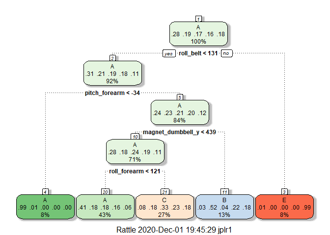

### Executive Summary
One thing that people regularly do is quantify how *much* of a particular activity they do, but they rarely quantify how *well they do it*. The goal of this project is to use data from accelerometers on the belt, forearm, arm, and dumbell of 6 participants, in order to predict the manner in which they did the exercise. They were asked to perform barbell lifts correctly and incorrectly in 5 different ways. The data for this project come from this source: http://web.archive.org/web/20161224072740/http:/groupware.les.inf.puc-rio.br/har.

### Loading libraries and data
First, the two datasets (training and testing) are loaded, together with the libraries that will be used.

```r
library(caret)
library(randomForest)
library(rattle)
library(rpart)
library(rpart.plot)
## Getting training and testing URL links
trainingLink <- "https://d396qusza40orc.cloudfront.net/predmachlearn/pml-training.csv"
testingLink <- "https://d396qusza40orc.cloudfront.net/predmachlearn/pml-testing.csv"
## Downloading data into the directory folder
download.file(trainingLink, destfile = "training.csv")
download.file(testingLink, destfile="testing.csv")
## Loading data into the workspace
training <- read.csv("training.csv", na.strings = c("NA", "#DIV/0!", ""))
testing <- read.csv("testing.csv", na.strings = c("NA", "#DIV/0!", ""))
```

### Cleaning data
Second, the datasets are cleaned from unnecessary information.

```r
## Deleting NA predictors
training <- training[, colSums(is.na(training)) == 0]
testing <- testing[, colSums(is.na(testing)) == 0]
## Deleting unnecesary columns
training <- training[, -c(1:7)]
testing <- testing[, -c(1:7)]
```

### Partitioning training data
Third, the training dataset is partitioned into training and validation sets, setting a seed before to make the analysis reproducible.

```r
set.seed(31721)
inTrain <- createDataPartition(training$classe, p = 0.7, list = F)
trainTrain <- training[inTrain, ]
trainValid <- training[-inTrain, ]
dim(trainTrain)
```

```
FALSE [1] 13737    53
```

```r
dim(trainValid)
```

```
FALSE [1] 5885   53
```

### Modelling and cross validation
Before testing a final model, different machine learning models will be trained to see their accuracy.

```r
## Modelling with regression trees
rpartModel <- train(classe ~ ., data = trainTrain, method = "rpart")
rpartPred <- predict(rpartModel, trainValid)
confusionMatrix(factor(trainValid$classe), rpartPred)
```

```
FALSE Confusion Matrix and Statistics
FALSE 
FALSE           Reference
FALSE Prediction    A    B    C    D    E
FALSE          A 1510   27  131    0    6
FALSE          B  467  376  296    0    0
FALSE          C  489   42  495    0    0
FALSE          D  431  179  354    0    0
FALSE          E  154  165  286    0  477
FALSE 
FALSE Overall Statistics
FALSE                                           
FALSE                Accuracy : 0.4856          
FALSE                  95% CI : (0.4728, 0.4985)
FALSE     No Information Rate : 0.5184          
FALSE     P-Value [Acc > NIR] : 1               
FALSE                                           
FALSE                   Kappa : 0.3278          
FALSE                                           
FALSE  Mcnemar's Test P-Value : NA              
FALSE 
FALSE Statistics by Class:
FALSE 
FALSE                      Class: A Class: B Class: C Class: D Class: E
FALSE Sensitivity            0.4949  0.47655  0.31690       NA  0.98758
FALSE Specificity            0.9421  0.85027  0.87717   0.8362  0.88800
FALSE Pos Pred Value         0.9020  0.33011  0.48246       NA  0.44085
FALSE Neg Pred Value         0.6341  0.91298  0.78041       NA  0.99875
FALSE Prevalence             0.5184  0.13407  0.26542   0.0000  0.08207
FALSE Detection Rate         0.2566  0.06389  0.08411   0.0000  0.08105
FALSE Detection Prevalence   0.2845  0.19354  0.17434   0.1638  0.18386
FALSE Balanced Accuracy      0.7185  0.66341  0.59704       NA  0.93779
```

```r
fancyRpartPlot(rpartModel$finalModel)
```

<!-- -->

```r
## Modelling with Linear Discriminant Analysis
ldaModel <- train(classe ~ ., data = trainTrain, method = "lda")
ldaPred <- predict(ldaModel, trainValid)
confusionMatrix(factor(trainValid$classe), ldaPred)
```

```
FALSE Confusion Matrix and Statistics
FALSE 
FALSE           Reference
FALSE Prediction    A    B    C    D    E
FALSE          A 1357   30  153  128    6
FALSE          B  180  741  141   39   38
FALSE          C   99   99  685  130   13
FALSE          D   48   38  120  722   36
FALSE          E   43  205   97  103  634
FALSE 
FALSE Overall Statistics
FALSE                                          
FALSE                Accuracy : 0.7033         
FALSE                  95% CI : (0.6915, 0.715)
FALSE     No Information Rate : 0.2935         
FALSE     P-Value [Acc > NIR] : < 2.2e-16      
FALSE                                          
FALSE                   Kappa : 0.6247         
FALSE                                          
FALSE  Mcnemar's Test P-Value : < 2.2e-16      
FALSE 
FALSE Statistics by Class:
FALSE 
FALSE                      Class: A Class: B Class: C Class: D Class: E
FALSE Sensitivity            0.7858   0.6658   0.5727   0.6435   0.8721
FALSE Specificity            0.9238   0.9166   0.9273   0.9492   0.9131
FALSE Pos Pred Value         0.8106   0.6506   0.6676   0.7490   0.5860
FALSE Neg Pred Value         0.9121   0.9216   0.8948   0.9187   0.9806
FALSE Prevalence             0.2935   0.1891   0.2032   0.1907   0.1235
FALSE Detection Rate         0.2306   0.1259   0.1164   0.1227   0.1077
FALSE Detection Prevalence   0.2845   0.1935   0.1743   0.1638   0.1839
FALSE Balanced Accuracy      0.8548   0.7912   0.7500   0.7963   0.8926
```

```r
## Modelling with random forest
rfModel <- train(classe ~ ., data = trainTrain, method = "rf")
rfPred <- predict(rfModel, trainValid)
confusionMatrix(factor(trainValid$classe), rfPred)
```

```
FALSE Confusion Matrix and Statistics
FALSE 
FALSE           Reference
FALSE Prediction    A    B    C    D    E
FALSE          A 1674    0    0    0    0
FALSE          B    9 1129    1    0    0
FALSE          C    0    3 1022    1    0
FALSE          D    0    0   13  950    1
FALSE          E    0    0    3    2 1077
FALSE 
FALSE Overall Statistics
FALSE                                           
FALSE                Accuracy : 0.9944          
FALSE                  95% CI : (0.9921, 0.9961)
FALSE     No Information Rate : 0.286           
FALSE     P-Value [Acc > NIR] : < 2.2e-16       
FALSE                                           
FALSE                   Kappa : 0.9929          
FALSE                                           
FALSE  Mcnemar's Test P-Value : NA              
FALSE 
FALSE Statistics by Class:
FALSE 
FALSE                      Class: A Class: B Class: C Class: D Class: E
FALSE Sensitivity            0.9947   0.9973   0.9836   0.9969   0.9991
FALSE Specificity            1.0000   0.9979   0.9992   0.9972   0.9990
FALSE Pos Pred Value         1.0000   0.9912   0.9961   0.9855   0.9954
FALSE Neg Pred Value         0.9979   0.9994   0.9965   0.9994   0.9998
FALSE Prevalence             0.2860   0.1924   0.1766   0.1619   0.1832
FALSE Detection Rate         0.2845   0.1918   0.1737   0.1614   0.1830
FALSE Detection Prevalence   0.2845   0.1935   0.1743   0.1638   0.1839
FALSE Balanced Accuracy      0.9973   0.9976   0.9914   0.9970   0.9990
```

### Testing the chosen model
According to the cross validation, the model with highest accuracy is random forest, although it takes a very long time to process. For that reason, the random forest model is used to predict on the test set.

```r
finalPred <- predict(rfModel, testing)
finalPred
```

```
FALSE  [1] B A B A A E D B A A B C B A E E A B B B
FALSE Levels: A B C D E
```
